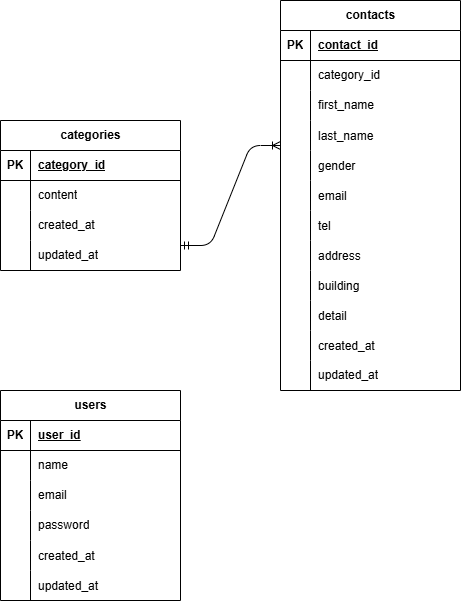

# アプリケーション名

お問い合わせフォーム

# Dockerビルド

git@github.com:aiina-yya/otoiawase.git
docker-compose up -d --build

# Laravel環境構築

・docker-compose up -d --build
・docker-compose exec php bash
・composer install
・cp .env.example.env,環境構築を適宜変更
・php artisan key:generate
・php artisan migrate
・php artisan db:seed

#　使用技術
・laravel
・php": "^7.3|^8.0"
・mysql:8.0.26
・nginx:1.21.1

# ER図

#　開発環境
・お問い合わせ画面：http://localhost/
・お問い合わせ確認画面:http://localhost/confirm
・お問い合わせ完了画面：http://localhost/thanks
・ユーザー登録:http://locakhost/register
・ログイン画面：http://localhost/login
・管理画面：http://localhost/admin
・phpMyAdmin:http://localhost:8080/
